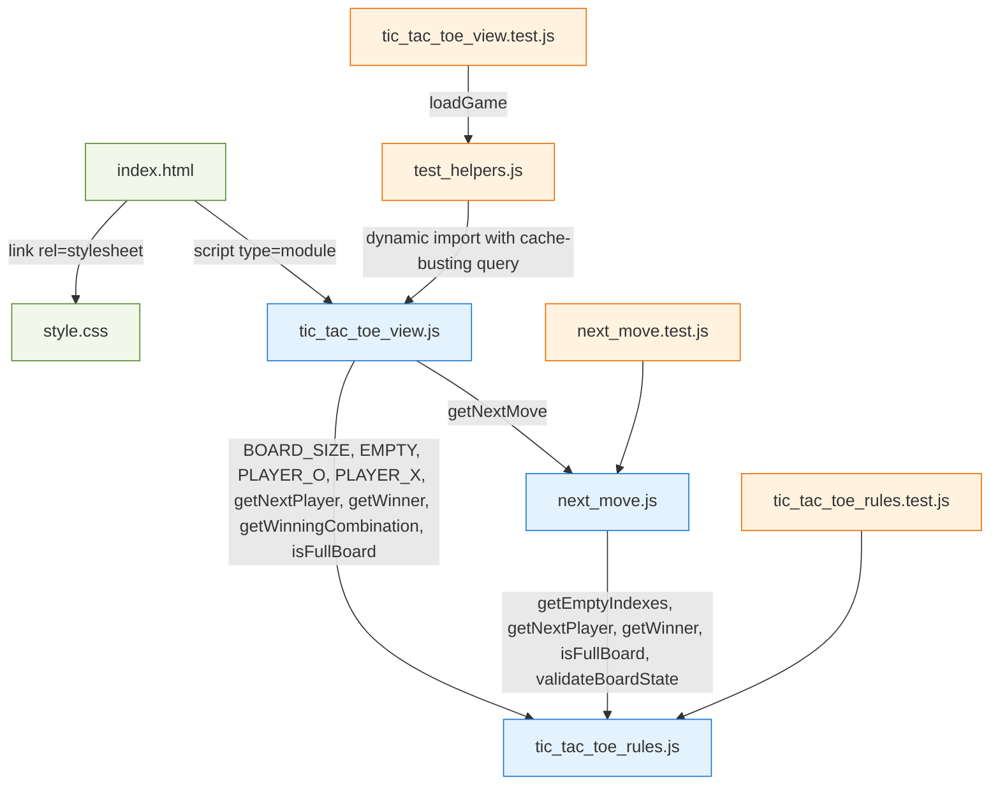
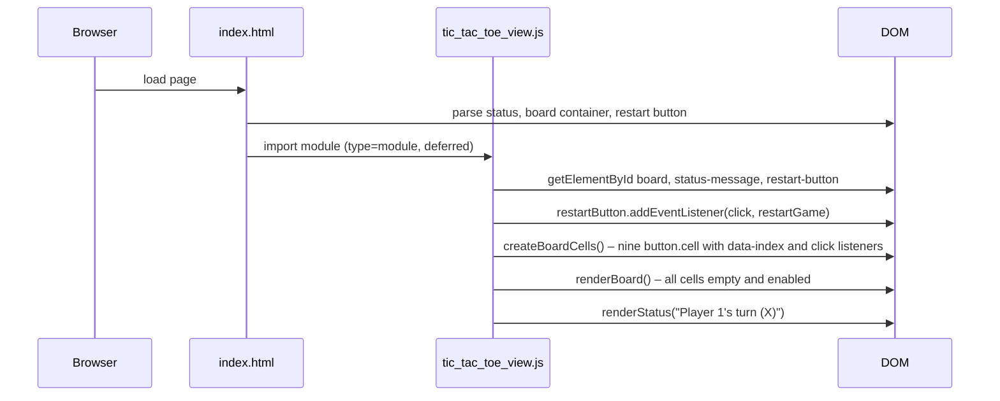
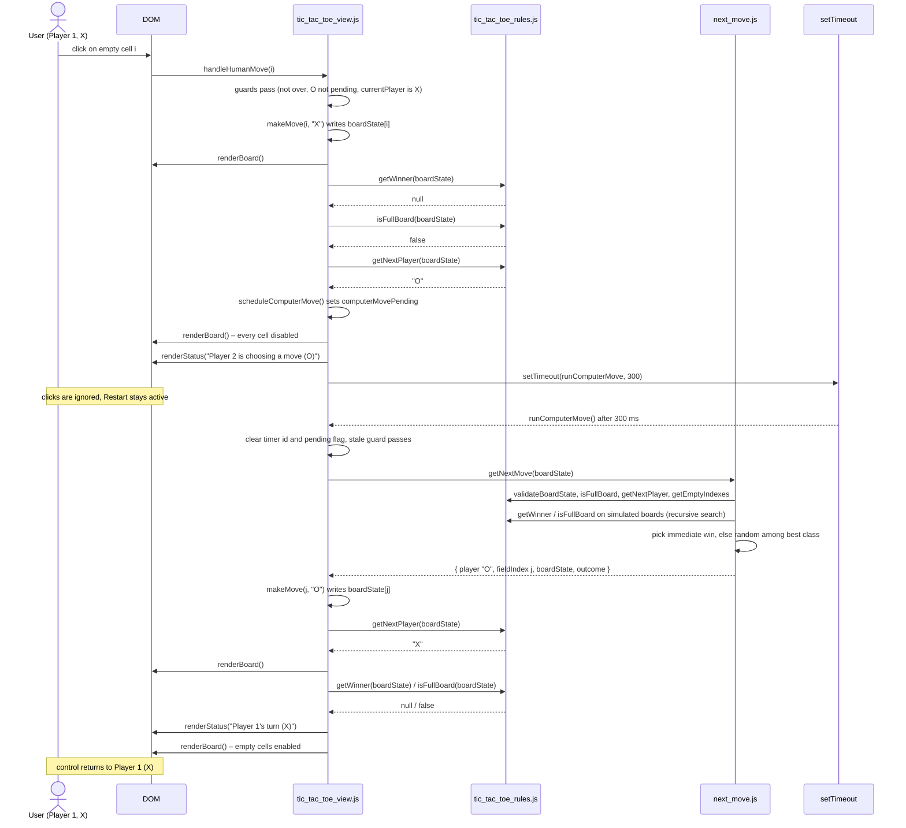

# Architecture

The application is a small, layered, dependency-free ES-module program that runs directly in the
browser. It consists of three production JavaScript modules plus an HTML shell and a stylesheet.
Game rules and behaviour are described in [business-logic.md](./business-logic.md); per-function
details are in [codebase-reference.md](./codebase-reference.md).

## Layers

| Layer | File | DOM? | Timers? | Randomness? | Owns mutable state? |
|---|---|---|---|---|---|
| Rules (pure) | [`tic_tac_toe_rules.js`](../tic-tac-toe/tic_tac_toe_rules.js) | no | no | no | no |
| Move selection (pure apart from `Math.random`) | [`next_move.js`](../tic-tac-toe/next_move.js) | no | no | yes (`Math.random`) | no |
| View / controller | [`tic_tac_toe_view.js`](../tic-tac-toe/tic_tac_toe_view.js) | yes | yes (`setTimeout`/`clearTimeout`) | no (indirectly via `getNextMove`) | yes |
| Shell | [`index.html`](../tic-tac-toe/index.html), [`style.css`](../tic-tac-toe/style.css) | — | — | — | — |

The dependency direction is strictly downward (view → move selection → rules) with no cycles.

## Module dependency diagram

Actual `import` relationships, including test files:

Verified facts:

- `tic_tac_toe_rules.js` imports nothing.
- `next_move.js` imports only from `tic_tac_toe_rules.js` (functions only, no constants).
- `tic_tac_toe_view.js` imports from both `next_move.js` and `tic_tac_toe_rules.js`.
- No module imports `tic_tac_toe_view.js` except the test helper (dynamically).
- `index.html` references `style.css` and `tic_tac_toe_view.js` only.

## Module descriptions

### `tic-tac-toe/tic_tac_toe_rules.js` – pure rules

| Aspect | Details |
|---|---|
| Purpose | Encode the rules of Tic-Tac-Toe as pure functions over a nine-cell board array. |
| Responsibilities | Board validation; empty/full detection; winning-line and winner detection; empty-index listing; next-player calculation. |
| Imports | none |
| Imported by | `next_move.js`, `tic_tac_toe_view.js`, `tic_tac_toe_rules.test.js` |
| Exports | Constants `EMPTY`, `PLAYER_X`, `PLAYER_O`, `BOARD_SIZE`; functions `validateBoardState`, `isEmptyBoard`, `isFullBoard`, `getWinningCombination`, `getWinner`, `getEmptyIndexes`, `getNextPlayer` |
| Private | `VALID_CELL_VALUES` (Set), `WINNING_COMBINATIONS` (array of index triples) |
| State owned | none (no module-level mutable state) |
| Side effects | none; never mutates its arguments; throws `Error` on invalid input |
| Not responsible for | Choosing moves, applying moves, tracking whose turn it is over time, rendering, timers, detecting a draw as a named concept (callers combine `getWinner` + `isFullBoard`). |

### `tic-tac-toe/next_move.js` – computer move selection

| Aspect | Details |
|---|---|
| Purpose | Decide the next move for whoever is on turn, using exhaustive look-ahead with random tie-breaking. |
| Responsibilities | Validate input; short-circuit full boards; find immediate wins; recursively evaluate every candidate; prefer forced wins, then draws; choose randomly within the preferred class; return an immutable move result. |
| Imports | `getEmptyIndexes`, `getNextPlayer`, `getWinner`, `isFullBoard`, `validateBoardState` from `./tic_tac_toe_rules.js` |
| Imported by | `tic_tac_toe_view.js`, `next_move.test.js` |
| Exports | `getNextMove(boardState)` |
| Private | `OUTCOME_WIN`, `OUTCOME_NOT_WINNING`, `OUTCOME_DRAW`, `createMoveResult`, `invertOpponentOutcome`, `findSafeMoves`, `selectRandomly` |
| State owned | none |
| Side effects | Reads `Math.random`. Never mutates the input board (copies via spread). Throws (propagated from rules) on invalid boards. |
| Not responsible for | Knowing which player is the computer (it serves whoever is next), applying the move to real state, timing/delays, rendering, checking whether the game has already ended (a board with an existing line is not rejected). |

### `tic-tac-toe/tic_tac_toe_view.js` – view and controller

| Aspect | Details |
|---|---|
| Purpose | Wire the DOM to the rules and the move selector; run the human-vs-computer game loop. |
| Responsibilities | Own the live `boardState`; build the nine cell buttons; render marks, disabled states, ARIA labels, winning highlight, and status text; accept/reject human clicks; schedule and run the delayed computer move; end the game on win/draw; restart. |
| Imports | `getNextMove` from `./next_move.js`; `BOARD_SIZE`, `EMPTY`, `PLAYER_O`, `PLAYER_X`, `getNextPlayer`, `getWinner`, `getWinningCombination`, `isFullBoard` from `./tic_tac_toe_rules.js` |
| Imported by | `index.html` (`<script type="module">`); `test_helpers.js` (dynamic `import()` with a cache-busting query string) |
| Exports | **none** – the module runs its setup on evaluation |
| Private constants | `COMPUTER_MOVE_DELAY_MS = 300`, `STATUS_HUMAN_TURN`, `STATUS_COMPUTER_TURN`, `STATUS_DRAW`, `STATUS_WIN` |
| State owned | `boardState` (array, mutated in place), `currentPlayer`, `gameIsOver`, `computerMovePending`, `computerMoveTimer`; DOM references `boardElement`, `statusMessageElement`, `restartButton` |
| Side effects | On import: `document.getElementById` ×3, registers the restart click listener, clears `#board` and appends nine `<button>` elements each with a click listener, renders board and status. During play: DOM mutation, `setTimeout`/`clearTimeout`. May throw `TypeError` at load if the three elements are missing, and `Error` from `runComputerMove` if `getNextMove` returns a non-O move (defensive). |
| Not responsible for | Rule evaluation (delegated to rules), move choice (delegated to `next_move.js`), styling (CSS), persistence (none – state lives in memory only). |

### `tic-tac-toe/index.html` – shell

Provides the three elements the view requires by id – `#status-message`, `#board`,
`#restart-button` – the heading, the initial static status text `Player 1's turn (X)`, and loads
`style.css` and `tic_tac_toe_view.js` (as a module, therefore deferred until parsing completes).
Cells are not present in the HTML; the view generates them.

### `tic-tac-toe/style.css` – presentation

Pure presentation: centred card layout, 3×3 CSS grid for `.board`, square `.cell` buttons,
`mark-x` (blue) / `mark-o` (red) colours, `winning-cell` (green) highlight, `:disabled` cursor,
`:focus-visible` outline. No JavaScript reads CSS values.

### `tic-tac-toe/test_helpers.js` – test infrastructure (not shipped)

| Aspect | Details |
|---|---|
| Purpose | Let the browser-only view module run under Node's test runner. |
| Responsibilities | Provide a minimal fake `document` (`getElementById`, `createElement`) and fake elements (`classList`, `dataset`, `attributes`, `disabled`, `textContent`, `innerHTML` setter that clears children when set to `""`, `appendChild`, `addEventListener`, `click`); replace `globalThis.setTimeout`/`clearTimeout` with an on-demand queue; load a fresh view instance per test via `import("./tic_tac_toe_view.js?instance=N")`; stub `Math.random`; restore all globals. |
| Imports | none |
| Imported by | `tic_tac_toe_view.test.js` |
| Exports | `loadGame()` |
| Private | `FakeClassList`, `FakeElement`, `createFakeDocument`, `installFakeTimers`, `loadCounter` |

## Startup sequence

## Normal turn – sequence diagram

The flow for one complete round (X then O) when the game does not end:

If `getWinner` returns the moving player or `isFullBoard` is true inside `finishTurn`, the sequence
stops there: `gameIsOver = true`, the board is rendered disabled, the winning triple (if any) is
highlighted, and the win/draw status is shown. No computer move is scheduled after X wins or draws.

## State ownership

All mutable game state lives in `tic_tac_toe_view.js` module scope. Because the module has no
exports and is evaluated once per page load, there is exactly one game per page.

| Variable | Type | Initial | Mutated by |
|---|---|---|---|
| `boardState` | `string[9]` (same array instance for the page lifetime) | nine `"empty"` | `makeMove` (single cell), `restartGame` (`fill`) |
| `currentPlayer` | `"X"` \| `"O"` | `"X"` | `handleHumanMove`, `runComputerMove`, `restartGame` |
| `gameIsOver` | boolean | `false` | `finishTurn` (→ `true`), `restartGame` (→ `false`) |
| `computerMovePending` | boolean | `false` | `scheduleComputerMove` (→ `true`), `runComputerMove`, `restartGame` (→ `false`) |
| `computerMoveTimer` | timer id \| `null` | `null` | `scheduleComputerMove`, `runComputerMove`, `cancelPendingComputerMove` |

The DOM is always rendered *from* `boardState`; the DOM is never read back to derive state.

## Asynchronous behaviour

- **Single delayed action.** The only asynchronous operation is the computer's move, delayed by
  `COMPUTER_MOVE_DELAY_MS = 300` ms via `setTimeout`. At most one timer exists at a time because a
  new one can only be scheduled after a human move, which is only accepted when
  `computerMovePending` is `false`.
- **Cancellation.** `restartGame` → `cancelPendingComputerMove` → `clearTimeout(computerMoveTimer)`
  and resets the id to `null`.
- **Stale-callback protection.** `runComputerMove` first resets `computerMoveTimer` and
  `computerMovePending`, then returns early (after a `renderBoard()`) if `gameIsOver` is true or
  `currentPlayer !== "O"`. In the current code this branch is unreachable through the UI, because
  every path that changes those conditions while a timer is pending (only `restartGame`) also
  cancels the timer. It is a defensive second layer.
- **No game identifier.** There is no generation counter or game id attached to the timer callback;
  correctness relies on the timer being cancelled and on the state guard above.
- **Synchronous search.** `getNextMove` runs synchronously inside the timer callback; UI stays
  blocked for the duration of the search (tens of milliseconds for ≤ 8 empty cells).
- **Error propagation.** Exceptions inside `runComputerMove` (e.g. the defensive `Error` when the
  result is not an O move) are thrown from the timer callback and surface as uncaught errors; there
  is no `try/catch`, and the flags have already been reset so the UI would show enabled empty cells
  with the stale `Player 2 is choosing a move (O)` status.

## Testing architecture

Tests run under Node's built-in `node:test` runner (`npm test` in `tic-tac-toe/`). The two pure
modules are tested directly. The view is tested by `test_helpers.js`, which installs a fake
`document` and fake timers on `globalThis` *before* dynamically importing a fresh copy of the view
module (`?instance=N` query defeats the module cache). Randomness is made deterministic by stubbing
`Math.random`. See [test-cases.md](./test-cases.md).
